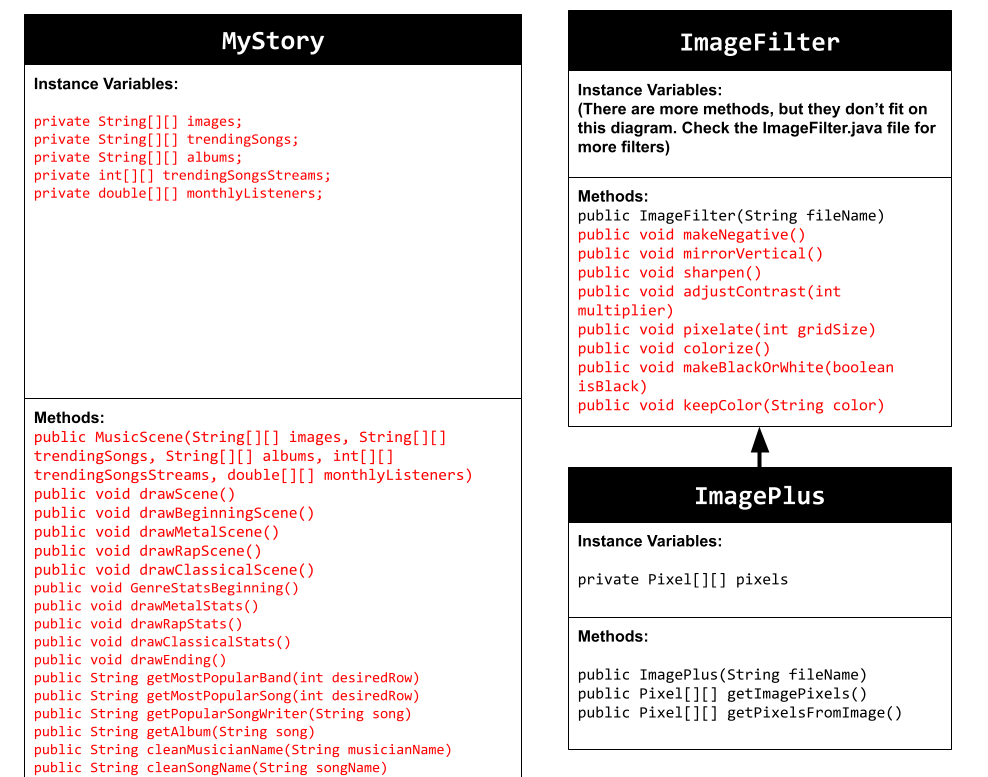
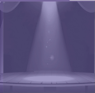

# Unit 5 - Personal Narrative

## Introduction

Images are often used to portray our personal experiences and interests. We also use image filters and effects to change or enhance the mood of an image. When combined into collages and presentations, these images tell a story about who we are and what is important to us. Your goal is to create a personal narrative using The Theater that consists of images of your personal experiences and/or interests, incorporates data related to these experiences and/or interests that can be organized in a 2D array, and uses image filters and effects to change or enhance the mood of your images.

## Requirements

Use your knowledge of object-oriented programming, two-dimensional (2D) arrays, and algorithms to create your personal narrative collage or animation:

- **Create at least two 2D arrays** – Create at least two 2D arrays to store the data that will make up your visualization.
- **Implement one or more algorithms** – Implement one or more algorithms that use loops and two-way or multi-selection statements with compound Boolean expressions to analyze the data.
- **Use Image Filters** - Include multiple image filters learned from this unit, and additionally create new ones of your own.
- **Use methods in the String class** – Use one or more methods in the String class in your program, such as to determine whether the name of an image file contains specific characters.
- **Create a visualization** – Create an image or animation that conveys the story of the data by illustrating the patterns or relationships in the data.
- **Document your code** – Use comments to explain the purpose of the methods and code segments and note any preconditions and postconditions.

## UML Diagram

Put and image of your UML Diagram here. Upload the image of your UML Diagram to your repository, then use the Markdown syntax to insert your image here. Make sure your image file name is one work, otherwise it might not properly get display on this README.

## Video

Record a short video of your story to display here on your README. You can do this by:

- Screen record your project running on Code.org.
- Upload that recording to YouTube.
- Take a thumbnail for your image.
- Upload the thumbnail image to your repo.
- Use the following markdown

## Story Description

Write a description of the story that your animation showcases. Give addional context for your story here in the case your animation is more abstract and only has images and little text. Lastly, include what data in your project is represented in 2D arrays and how those directly relate to the story your animation showcase.

My story is showcasing what I like to listen to in terms of music. This includes my favorite metal bands, rappers, and classical composers. It also showcases some of their statistics such as which has the most monthly listeners and who made the most popular song with how many streams. The data I included in my project are images of the musicians (the file names also doubled as what they are named as in the animation), their monthly listeners (to compare which out of all in their genre has the most listeners), their most trending song (to compare which has the most popular song), each trending song's streams (used to compare the songs' popularity), and the pictures of the albums these songs came from (used as an addition to display the most popular song and where it came from).

## Image Filter Analysis

Choose at least 2 filters uses in your animation to explain how the pixels are modified. If you created a new image filter that was not one of the ones from this unit, make sure to explain and analyze that filter(s) before choosing ones that came from this unit.

The filter I made changed all the color values to either 0 or 255 to create black and white respectively simply by setting their values to said numbers. One filter I used from the unit is the pixelate filter. The number to which they are set to depends on the boolean parameter isBlack (true results in black; false results in white). This filter grabs the red, green, blue color values from all of the pixels in a certain grid size and adds them all up. These values are then divided by the grid size, and each pixel in that grid takes on these average values. Another filter I used is the colorize filter. This filter adds up all of the RGB color values of a pixel and divides them by 3 (three colors). If the average is less than 85, that pixel turns all red. If the average is less than 170, then the pixel turns completely green. Otherwise, the pixel turns completely blue.
